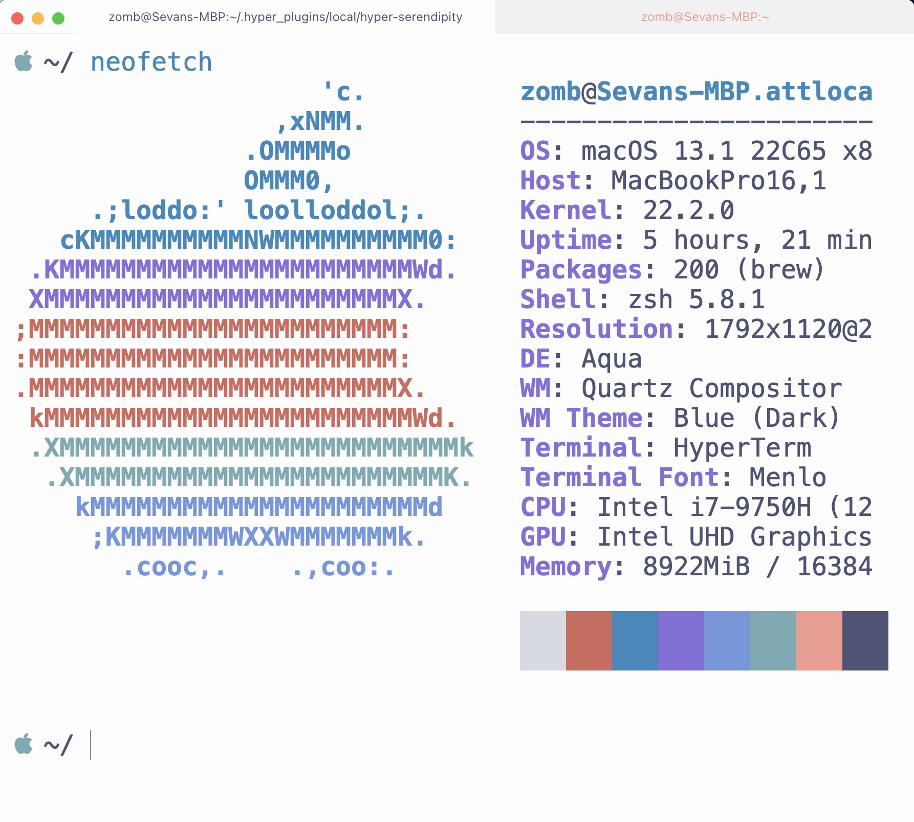
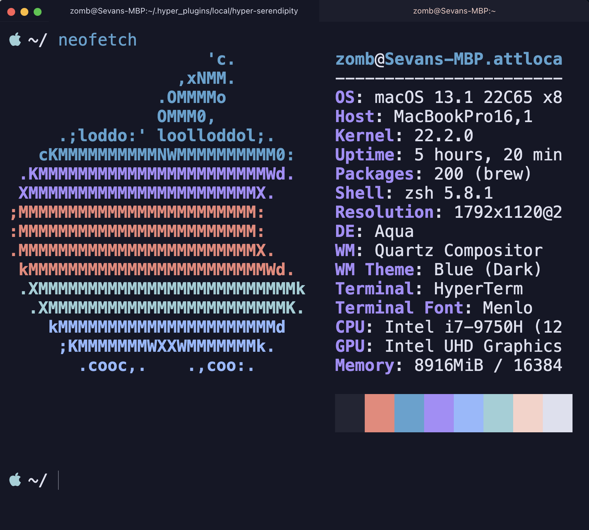

## Hyper Serendipity
[](https://www.npmjs.com/package/hyper-serendipity)

A port of the [Serendipity](https://serendipitytheme.com/) color scheme for [Hyper](https://hyper.is/)

## Installation
- Clone this repo in `.hyper_plugins/local`
- Add "hyper-serendipity" to the `localPlugins` array in your `.hyper.js` config file

## Choosing a theme
- without customizing `.hyper.js`, this theme will choose a color scheme based on the time you started a terminal session
- add the `hyperSerendipity` object to your `config` object in `.hyper.js` to switch themes
```
    // 'morning' | 'sunset' | 'morning'
    // if no config or invalid config,  default to dynamic theme (6am-6pm: morning | 6pm-10pm: sunset | 10pm-6am: midnight)
    hyperSerendipity: {
      theme: 'midnight'
    },
```
### Morning

### Midnight

